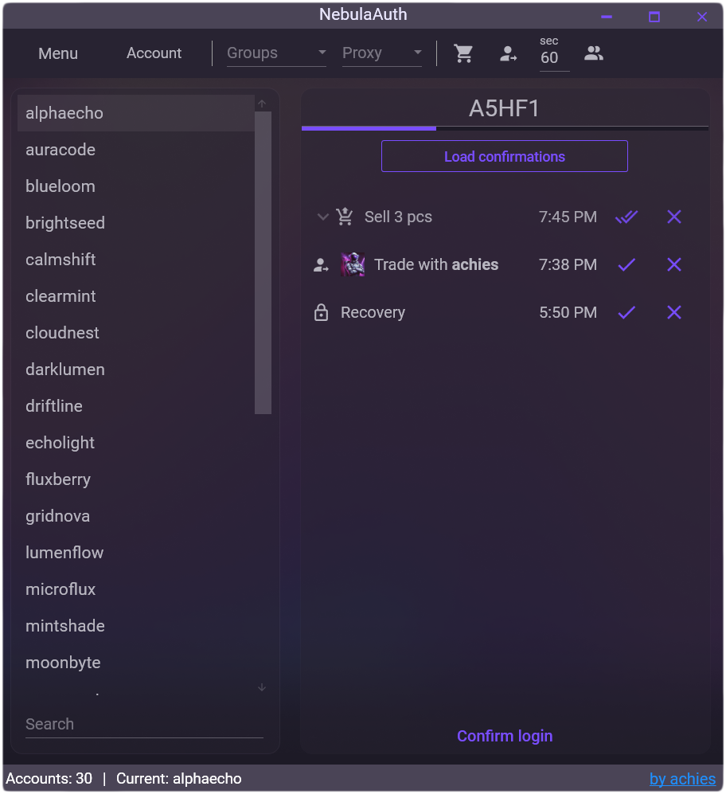

# NebulaAuth

<h3 align="center" style="margin-bottom:0">
  <a href="https://github.com/achiez/NebulaAuth-Steam-Desktop-Authenticator-by-Achies/releases/latest">Download latest version</a>
</h3>

<h3 align="center">
NebulaAuth is an application for emulating actions from the Steam Mobile App, replacing your smartphone when operating on Steam.
</h3>

NebulaAuth is an independent project and is not affiliated with Valve or Steam.

<h4 align="center"><a href="https://t.me/nebulaauth">Official Telegram Group</a></h4>
<h4 align="center"><a href="https://achiefy-project.gitbook.io/nebulaauth">Documentation</a></h4>

## Main advantages

  

- **Localization in six languages**: English, Russian, Ukrainian, Spanish, Turkish and Kazakh.
- **Full functionality of Steam Desktop Authenticator** reimagining [old app](https://github.com/Jessecar96/SteamDesktopAuthenticator)
- **Proxy support** in all account work processes.
- **Mafile grouping** for improved management.
- **Automatic confirmations of trades/market actions** to save time.
- **Bulk import of .mafiles** via Drag'n'Drop or Ctrl+V, including SDA-encrypted mafiles with automatic manifest detection.
- **Design customization** to personalize the interface.
- **Ability to confirm account login without entering a code** for easier access.
- **Auto-update** with SHA256 checksum verification, changelog viewer and flexible update options.
- **Automatic relogin in case of problems with the session** for continuous operation.
- **Intuitive interface** with tips and conveniences.
- **Continuous support** of application code and other features.

## Documentation

You can find the documentation for the application [here](https://achiefy-project.gitbook.io/nebulaauth). Currently, only the Russian version is available, but the English version will be released soon.

## Installation

1. If the application does not start, you need to install [.NET Desktop Runtime](https://dotnet.microsoft.com/en-us/download/dotnet/8.0)
2. [Download the program from the releases of this repository on Github](https://github.com/achiez/NebulaAuth-Steam-Desktop-Authenticator-by-Achies/releases/latest)
     * *For the safety of your data, download the application only from here*
4. Unpack the .zip file to any folder
5. Run the file **NebulaAuth.exe**

## Project Ownership

NebulaAuth is the original project by Achiefy™.

Please keep attribution and do not present modified versions as official.

AGPL-3.0 — see [LICENSE](/LICENSE).
